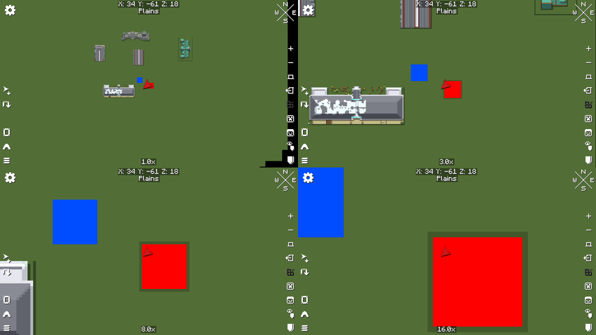
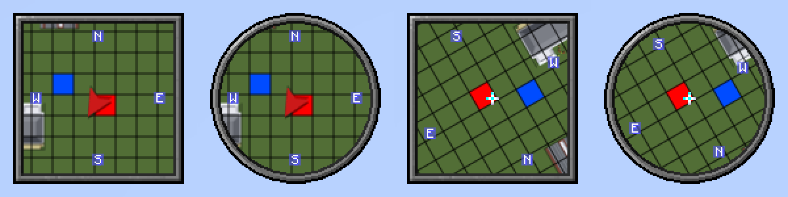

# Xaero render hooks (XaeroPlus-free rendering spike)

This is a proof of concept for drawing our overlay straight into Xaero's map framebuffers,
so the mod only needs Xaero's Minimap and Xaero's World Map, with no XaeroPlus. The spike
draws two solid quads, red over the player's chunk and blue over chunk 0,0, on both maps.

Spike code:

- `src/client/java/.../client/mixin/SpikeWorldMapMixin.java`: world map hook
- `src/client/java/.../client/mixin/SpikeMinimapMixin.java`: minimap hook
- `src/client/java/.../spike/HookSpike.java`: shared quad drawing. It does nothing unless
  the game runs with `-Dcrusalis.hookSpike=true`.
- `src/client/java/.../spike/HookSpikeAutoTest.java`: a dev-only self-test that runs only
  with `-Dcrusalis.hookSpike.autotest=true`.

## Versions examined

These are the jars installed in Lunar profile `1.21.11-creative`:

| Mod | Jar | Mod id | Version |
|---|---|---|---|
| Xaero's Minimap | `xaerominimap-fabric-1.21.11-26.5.0.jar` | `xaerominimap` (regular edition, **not** Fair-Play `xaerominimapfair`) | 26.5.0 |
| Xaero's World Map | `xaeroworldmap-fabric-1.21.11-1.46.0.jar` | `xaeroworldmap` | 1.46.0 |
| XaeroLib (jar-in-jar of both) | `xaerolib-fabric-1.21.11-1.7.3` | `xaerolib` | 1.7.3 |
| XaeroPlus (reference only) | `XaeroPlus-2.36.3+fabric-1.21.11-WM1.46.0-MM26.5.0.jar` | `xaeroplus` | 2.36.3 |

Both Xaero mods are on `https://chocolateminecraft.com/maven`, so `build.gradle` now compiles
against 1.46.0 and 26.5.0 directly.

## World map: `xaero.map.gui.GuiMap#render(GuiGraphics, int, int, float)`

**Injection point:** inject before the first `XaeroBufferProvider.endBatch()` inside the
slice that starts at `PUTFIELD GuiMap.prevLoadingLeaves` and ends at
`ImprovedFramebuffer.bindDefaultFramebuffer(Minecraft)`. At that point every map tile has
been drawn into `primaryScaleFBO`. Xaero's own chunk-hover and selection highlights are
queued in the same batch. Map elements (waypoints, player arrows, radar, etc.) come later,
after the FBO is composited to the screen. XaeroPlus wraps this same `endBatch` call
(`MixinGuiMap#drawWorldMapFeatures`), and our `@Inject` coexists with it (tested with and
without XaeroPlus).

**Locals** (captured by name, see the gotchas section):

- `matrixStack` (`PoseStack`)
- `renderTypeBuffers` (`XaeroBufferProvider`)
- `flooredCameraX` and `flooredCameraZ` (`int`)
- `fboScale` (`double`), if needed

**Camera and scale fields on `GuiMap`:**

- `private double cameraX, cameraZ`: the world block at the screen centre.
- `private double scale`: physical screen pixels per block. It equals
  `userScale * getScaleMultiplier(...)`, where the multiplier is 1 unless the window's
  short side is over 1080 px.
- `private static double destScale`: the zoom target (UI zoom).

**Transform at the hook:**

1. `scale(1/screenScale)`
2. `translate(windowW/2, windowH/2)`
3. If needed, an integer pixel offset to absorb the sub-pixel camera
4. `scale(fboScale, -fboScale)`. Y is flipped because the FBO is sampled upside down.
5. `translate(-primaryOffsetX, -primaryOffsetY)`

As a result, the pose's units are **world blocks relative to
`(flooredCameraX, flooredCameraZ)`**:

```
vertex(x = blockX - flooredCameraX, y = blockZ - flooredCameraZ)
```

This is the same convention `MapRenderHelper.renderDynamicHighlight` uses.

`fboScale` is `floor(scale)` when `scale >= 1`. Otherwise it equals `scale`, and
`flooredCameraX/Z` are snapped to the FBO pixel grid. Always use the locals and never
re-derive them from `cameraX`. After the hook, the FBO is drawn to screen with the
remaining `scale / fboScale` and a sub-pixel `secondaryOffset`. Our geometry is therefore
resampled together with the tiles, so it never drifts against them.

**Buffer:** `renderTypeBuffers.getBuffer(xaero.map.graphics.CustomRenderTypes.MAP_COLOR_OVERLAY)`

- Pipeline: XaeroLib `RP_POSITION_COLOR_NO_CULL`. That is a vanilla `RenderPipeline` with
  position-color and translucent blend.
- Output: `MAIN_TARGET`, which Xaero has rebound to `primaryScaleFBO`.
- The `endBatch()` we inject before flushes it, so no raw GL is needed.

## Minimap: `xaero.common.minimap.render.MinimapFBORenderer#renderChunksToFBO(...)`

**Injection point:** inject before the first `XaeroBufferProvider.endBatch()` in
`renderChunksToFBO`. At that point the 512×512 `scalingFramebuffer` holds:

- the map chunks, from either the world-map-backed path
  (`SupportXaeroWorldmap.drawMinimap`) or the minimap-only path (the `MinimapChunk` loop,
  also used for cave mode), and
- the queued chunk grid.

Right after this call, Xaero binds `rotationFramebuffer` and blits the scaling FBO into it.
That blit applies rotation (`-angle` about Z, unless north-locked) and the sub-block
offset. The circle/square mask and frame are applied later, when the rotation FBO is drawn
to the HUD. Anything we draw here therefore gets rotation, masking and opacity for free,
the same as the map itself. One hook covers both minimap source paths.

XaeroPlus needs two hooks for the same job: `MixinMinimapFBORenderer#drawMinimapFeatures`
wraps `SupportXaeroWorldmap.drawMinimap`, and `#drawMinimapFeaturesCaveMode` wraps
`MultiTextureRenderTypeRendererProvider.draw`.

**Locals:**

- `matrixStack`: a method argument. Xaero sets it to identity.
- `renderTypeBuffers`
- `xFloored` and `zFloored`
- If needed: `minX/minZ/maxX/maxZ` (the visible chunk range in 64-block Xaero "map chunks"),
  `playerChunkX/Z`, `offsetX/Z`, and `radiusBlocks`.

**Transform at the hook:**

- `RenderSystem.getModelViewStack()` is `translate(256, 256, -2000)`, then
  `scale(zoom, zoom, 1)`, with `helper.defaultOrtho(scalingFramebuffer)` as the projection.
- `matrixStack` is identity.

As a result, the units are **world blocks relative to `(xFloored, zFloored)`**, with +Y
pointing south:

```
vertex(x = blockX - xFloored, y = blockZ - zFloored)
```

At `zoom == 0.5`, `xFloored/zFloored` are rounded down to even numbers, which is another
reason to use the locals. Chunk→pixel scale on the FBO is `16 * zoom`. The visible radius
is `radiusBlocks = halfMaxVisibleLength / zoom`, and `halfMaxVisibleLength` includes a √2
factor when rotating or circular.

**Buffer:** `renderTypeBuffers.getBuffer(xaero.common.graphics.CustomRenderTypes.MAP_CHUNK_OVERLAY)`

- Pipeline: XaeroLib `RP_POSITION_COLOR_TRANSLUCENT`, which **culls back faces**. Emit quads
  with the same winding as `xaero.hud.render.util.RenderBufferUtil.addColoredRect`:
  `(x, y+h)`, `(x+w, y+h)`, `(x+w, y)`, `(x, y)`.
- Output: `MAIN_TARGET`, which is `scalingFramebuffer` at that point.

## Test results

To reproduce:

```
gradlew runClient -PhookSpikeAutotest
```

This needs a save at `run/saves/HookSpike` (any world) and, while the old renderer is still
in the mod, XaeroPlus in `run/mods`. The self-test:

1. Puts the player in spectator mode at 34.5, 18.5 (chunk 2,1, facing yaw 30).
2. Turns on Xaero's minimap chunk grid.
3. Screenshots all 4 minimap modes (north-locked or rotating, square or circle).
4. Screenshots the world map at 0.5×, 1×, 3×, 8× and 16×, logging `cameraX/Z/scale` for
   each.

**World map:** a script projects each chunk to `windowW/2 + (blockX - cameraX) * scale`
and samples pixels 1.5 px inside and outside every edge. Both quads matched at every zoom.
The only points skipped were those under the player arrow. At 16×, Xaero's own
mouse-hover chunk highlight frames the red quad exactly.



**Minimap:** each quad fills exactly one cell of Xaero's own chunk grid in all four modes.
The quads rotate with the map and are clipped by the circle mask.



The same results came out:

- with XaeroPlus 2.36.3 present, and
- with XaeroPlus removed. For that run the old `AechronisMapMod` entrypoint and the
  `xaeroplus` dependency were disabled temporarily, since the current renderer extends
  XaeroPlus classes.

**Not yet tested:** the Lunar `1.21.11-creative` profile itself. I couldn't drive the
Lunar launcher from my session, so all of the above ran in the Loom dev client with the
same mod versions. To check in Lunar:

1. Put `build/libs/Xaeros Fairplay Nation Overlay-1.0.0.jar` in the profile.
2. Add `-Dcrusalis.hookSpike=true` to Lunar's JVM arguments.

## Gotchas

- **Name-based `@Local`s need the LocalVariableTable.** Xaero's release jars ship it, and
  XaeroPlus relies on the same names (`flooredCameraX`, `xFloored`, `renderTypeBuffers`,
  etc.). If Xaero renames a local, the injector fails softly (`require = 0`) and the
  overlay disappears without crashing. Check the log for Mixin warnings after each Xaero
  update.
- **Line width:** world map geometry is in blocks at `fboScale` pixels per block, so a
  1-pixel border is `1 / fboScale` blocks wide. On the minimap, 1 pixel is `1 / zoom` blocks.
- **Text and labels don't belong in these FBO passes.** On the minimap they would rotate
  with the map, and on the world map they would be resampled. Labels need a second hook:
  - World map: the map-element pass after the FBO composite (`matrixStack.scale(scale)`,
    then `WorldMap.mapElementRenderHandler.render(...)`).
  - Minimap: the over-map renderer handler.
  
  That is the next spike if needed.
- **Culling for performance:** on the minimap, only emit chunks inside `minX..maxX` /
  `minZ..maxZ`. Those values are in 64-block units, so multiply by 4 for chunks. On the world
  map, compute the visible range from `cameraX/Z ± windowW/2/scale`.
- **Fair-Play:** these hooks don't read or change `HudMod.isFairPlay()`. Drawing into the
  map FBO needs no bypass, so the XaeroPlus fairplay mixin can simply be deleted. The
  Fair-Play edition (`xaerominimapfair`) isn't installed here, so the minimap hook is
  **untested on it**. It is believed to share the `xaero.common` / `xaero.hud` classes, but
  that needs a check.
- **Build:**
  - XaeroPlus 2.36.x jars are built with Loom 1.17 (Gradle 9.5), and this project's Loom
    1.16 refuses them. For that reason XaeroPlus stays compile-only at 2.30.10. This goes
    away once XaeroPlus is dropped.
  - Mod Menu 15.0.0 crashes the 1.21.11 dev client, so it is now `modCompileOnly`.

## What blocks the full rewrite

Nothing in the rendering path. Both hooks work with plain Xaero 1.46.0 / 26.5.0. What still
needs doing:

- `AechronisRenderer` / `XaeroPlusCompat` / `AechronisDrawManagerMixin` extend or reference
  XaeroPlus classes (`xaeroplus.module.Module`, `DrawFeature`, `DrawManager`). They have to
  be replaced by our own feature list that is drawn from these two hooks. Then
  `fabric.mod.json` can drop `xaeroplus` and depend on `xaerominimap` (or
  `xaerominimapfair`) plus `xaeroworldmap`.
- Labels and text need the separate post-composite hook described in the gotchas.
- The Lunar runtime check, and a check against the Fair-Play minimap edition.
